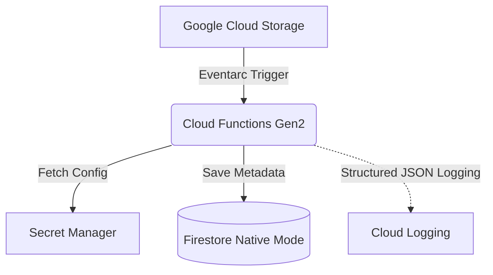

# Enterprise Secure Asset Vault & Event-Driven Processing Architecture

This repository contains an enterprise-grade event-driven asset processing architecture on Google Cloud. The solution demonstrates the integration of multiple serverless technologies to automatically process, validate, and catalog uploaded assets with a focus on security, observability, and scalability.

## Architecture




### Workflow
1. **Google Cloud Storage (GCS)**: A secure bucket acts as the entry point. When an asset is uploaded, GCS emits an event.
2. **Eventarc**: Captures the `google.cloud.storage.object.v1.finalized` event and reliably routes it to the Cloud Function.
3. **Cloud Functions (Gen 2)**: The core processing engine written in Python. It parses the CloudEvent, validates the metadata, and orchestrates the subsequent steps.
4. **Secret Manager**: The Cloud Function securely retrieves enterprise configuration settings.
5. **Firestore (Native Mode)**: A NoSQL document database stores the extracted asset metadata (e.g., CRC32C, size, content type, processing status) for downstream cataloging.

## Services Used
- **Cloud Storage**: Secure, durable object storage.
- **Eventarc**: Event routing infrastructure.
- **Cloud Functions (Gen2)**: Next-generation serverless execution environment based on Cloud Run.
- **Secret Manager**: Secure, centralized storage for sensitive data.
- **Firestore**: Fully managed, scalable NoSQL document database.
- **Cloud Logging**: Centralized, structured enterprise logging.

## Security Posture
- **Least Privilege IAM**: Resources are granted only the minimum permissions required (e.g., `roles/secretmanager.secretAccessor`, `roles/datastore.user`).
- **No Hardcoded Secrets**: All configuration is securely sourced from Secret Manager at runtime.
- **Zero Credentials in Git**: Comprehensive `.gitignore` rules prevent credential leakage.

## Deployment

The architecture is fully automated via Python scripts utilizing the Google Cloud SDK.

1. Ensure you are authenticated with Google Cloud:
   ```bash
   gcloud auth login
   ```
2. Run the deployment script to provision resources:
   ```bash
   python scripts/deploy.py
   ```

## Testing
Run the automated end-to-end test script to validate the architecture:
```bash
python scripts/test.py
```
This script uploads a dummy asset, waits for processing, queries Firestore to confirm metadata extraction, and pulls execution logs.

## Cleanup
To remove all billable resources, run:
```bash
python scripts/cleanup.py
```

## Repository Structure
```
.
├── src/
│   ├── main.py              # Cloud Function Gen2 core logic
│   └── requirements.txt     # Python dependencies
├── scripts/
│   ├── deploy.py            # Infrastructure deployment orchestration
│   ├── test.py              # End-to-end automated testing
│   └── cleanup.py           # Resource deletion and teardown
├── .gitignore
├── LICENSE
└── README.md
```

## Skills Demonstrated
- Cloud Architecture & Systems Design
- Event-Driven Microservices
- Infrastructure as Code (IaC) principles
- Python Serverless Development
- Cloud Security Best Practices
- CI/CD & Automated Testing Strategies
