# Enterprise Secure Asset Vault & Event-Driven Processing Architecture


## Project Overview

An enterprise-grade event-driven architecture designed to securely process, validate, and catalog digital assets uploaded to the cloud. Built entirely on Google Cloud's serverless ecosystem, this architecture ensures high availability, automated scalability, and strict security compliance via least-privilege IAM and centralized secret management.

This project was built following industry best practices for Infrastructure-as-Code (IaC) deployment, robust error handling, and structured observability, demonstrating capabilities required for senior Cloud Engineering roles.

### Business Problem
Organizations require a secure and reliable mechanism to process digital assets submitted by third parties or internal systems. Manual processing is unscalable, while synchronous processing introduces bottlenecks. Furthermore, configurations and encryption parameters often leak into codebases, posing significant security risks.

### The Solution
A fully automated, event-driven pipeline that decoupling ingestion from processing:
1. Assets are securely deposited into **Cloud Storage**.
2. **Eventarc** captures the upload event and asynchronously routes it to a **Cloud Function (Gen 2)**.
3. The function retrieves encrypted configurations from **Secret Manager**.
4. The asset metadata is extracted and cataloged in a scalable **Firestore** database.
5. All operations emit structured logs to **Cloud Logging** for observability and compliance auditing.

---

## Architecture Overview

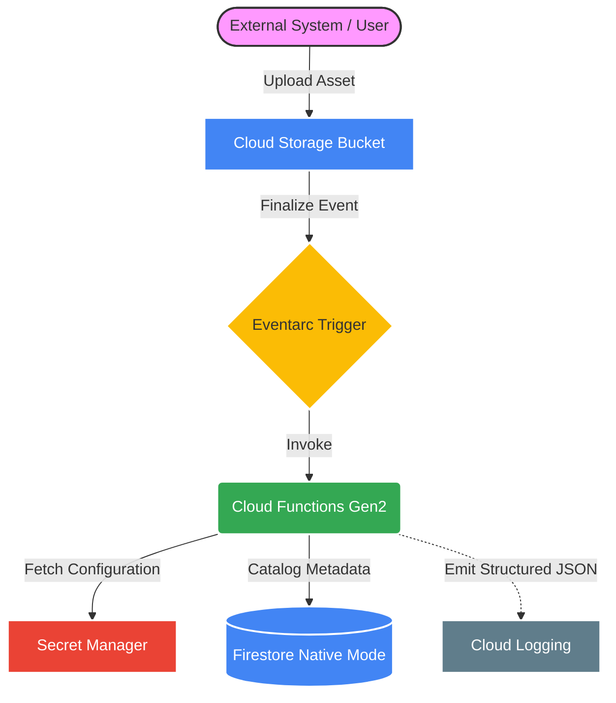

### End-to-End Workflow
1. **Ingestion**: The `enterprise-secure-asset-vault-*` bucket enforces uniform bucket-level access.
2. **Routing**: `google.cloud.storage.object.v1.finalized` events are caught by Eventarc, ensuring guaranteed delivery using underlying Pub/Sub mechanisms.
3. **Processing Engine**: The Gen2 Cloud Function processes the standard CloudEvents payload, performing dynamic configuration lookup.
4. **State Management**: Extracted characteristics (CRC32C, size, timestamps, content-type) are persisted as structured documents into the `asset-catalog` collection.

---

## Security Best Practices
- **Zero Hardcoded Secrets**: Python source code (`src/main.py`) relies entirely on Secret Manager for enterprise configuration.
- **Principle of Least Privilege**: The processing function runs under a dedicated service account identity, restricted to only `roles/secretmanager.secretAccessor` and `roles/datastore.user`.
- **Git Hygiene**: Comprehensive `.gitignore` completely isolates service account keys (`*.json`), local environment variables, and temporary artifacts from the repository.

---

## Deployment & Testing

The infrastructure is provisioned through custom automated Python deployment scripts that wrap the Google Cloud SDK, demonstrating programmatic orchestration of cloud environments.

### Deployment Summary
```bash
# Provision Cloud Storage, Secret Manager, Firestore, Eventarc, and deploy Gen2 Cloud Function
python scripts/deploy.py
```

### Testing Methodology
An automated test script simulates an enterprise file drop:
```bash
python scripts/test.py
```
**Validation Results**: The script confirms the GCS upload, pauses to allow asynchronous event propagation, queries Firestore to assert document creation, and finally streams execution logs to the console to verify a successful 200 OK execution.

---

## Recruiter Screenshot Gallery

### 1. Google Cloud Project Dashboard
Provides a holistic overview of the production environment.
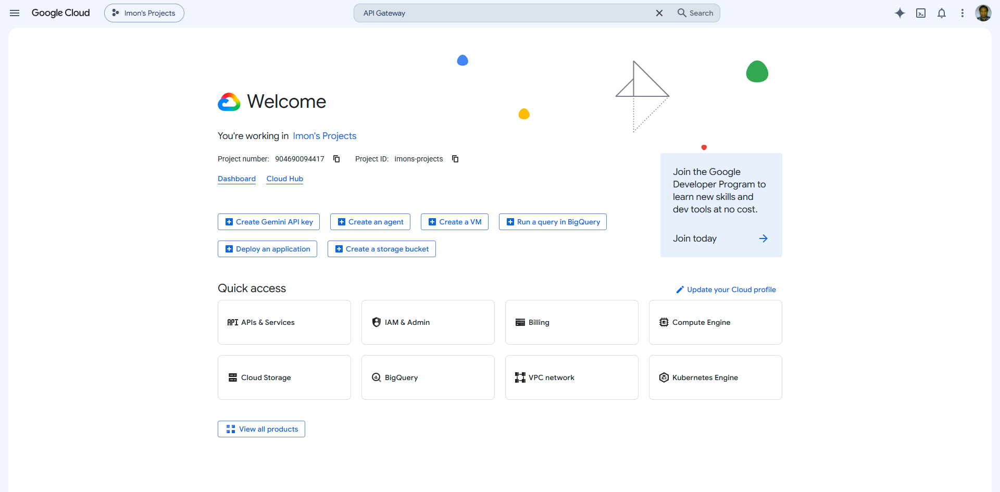

### 2. Cloud Storage Setup
The `enterprise-secure-asset-vault` bucket configuration.
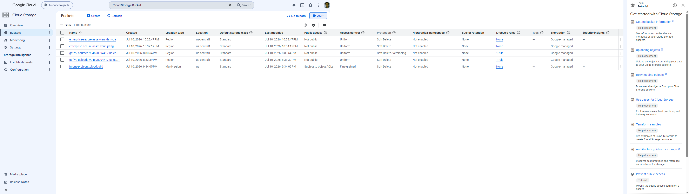

### 3. Uploaded Enterprise Asset
Demonstrates successful data ingestion.
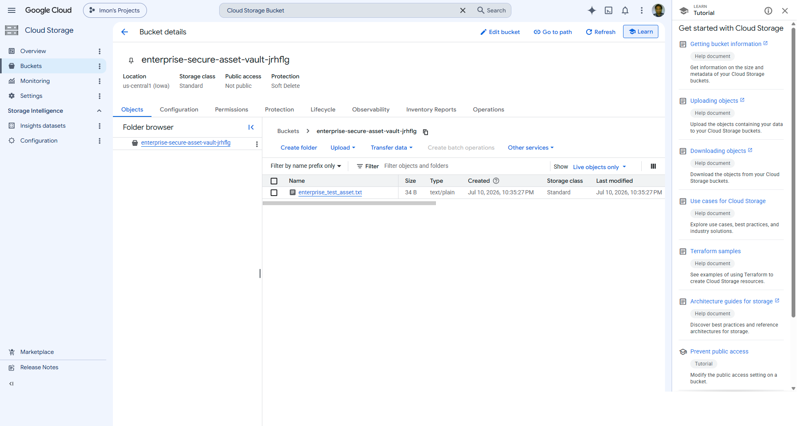

### 4. Cloud Functions (Gen2) Deployment
Highlights the serverless architecture, runtime environment (Python 3.10), and underlying Cloud Run revisions.
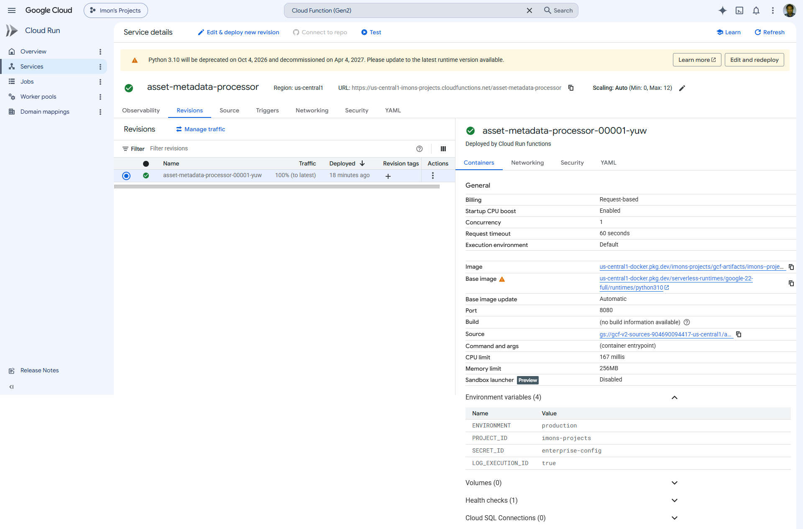

### 5. Cloud Function Source Code Configuration
Code successfully pushed and built within Google Cloud infrastructure.
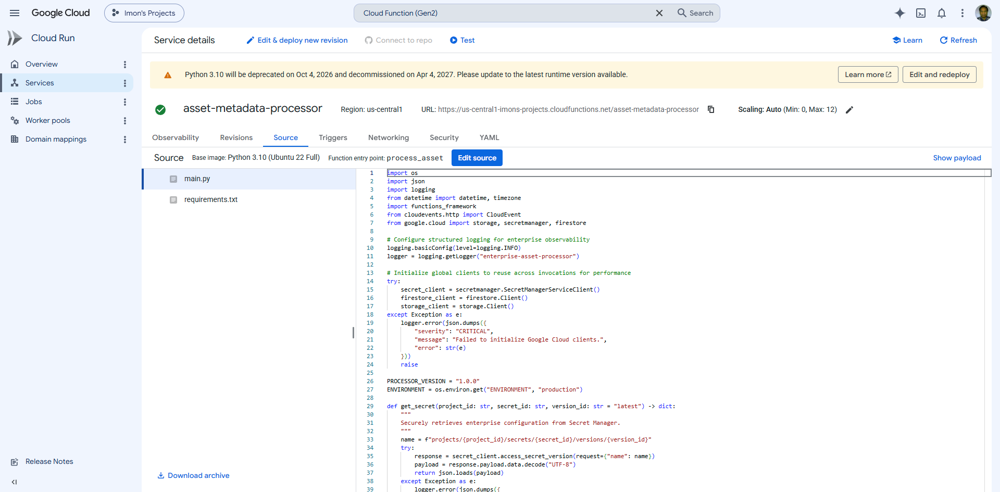

### 6. Eventarc Trigger Configuration
Seamless event routing from GCS to the processor function.
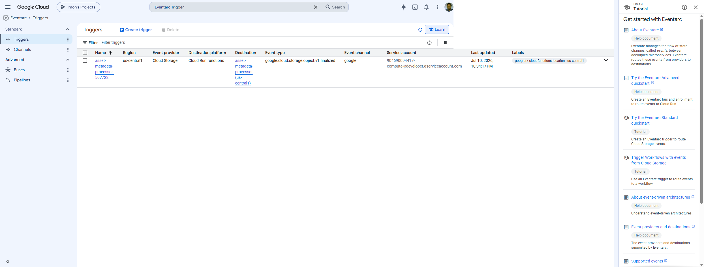

### 7. Secret Manager Integration
Secure storage of the `enterprise-config` parameters.
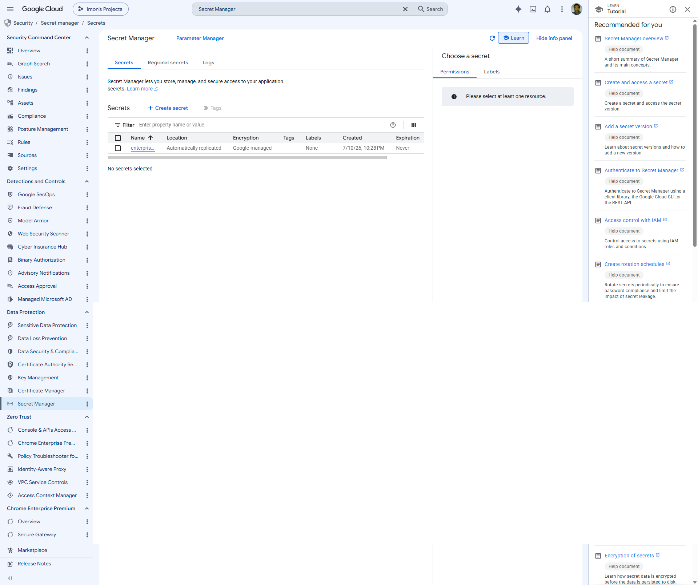

### 8. Firestore Database
The Native Mode database configuration ensuring scalable document storage.
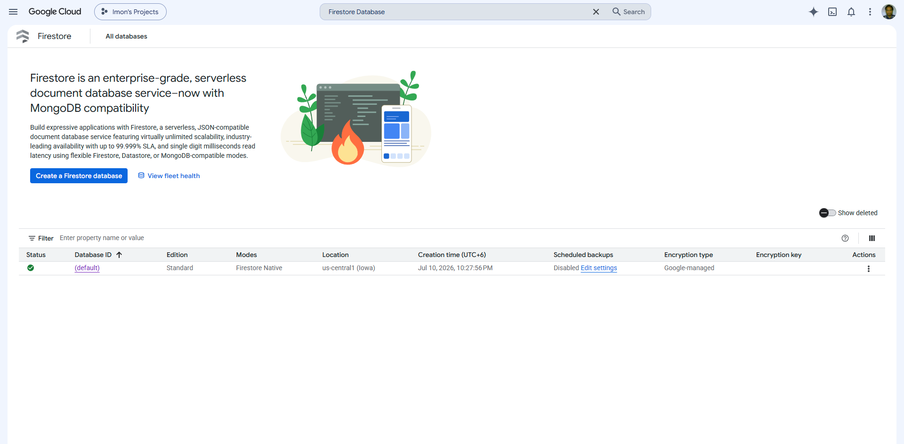

### 9. Firestore Data Catalog
The processed metadata accurately stored within the `asset-catalog` collection.
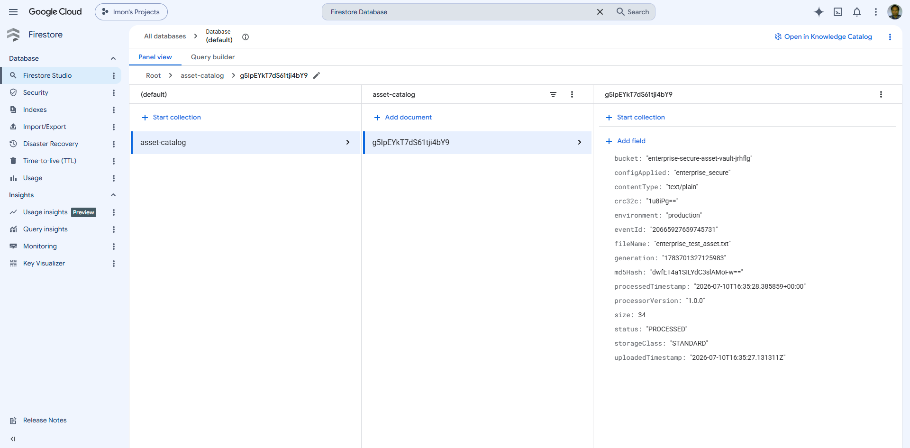

### 10. Cloud Logging & Observability
Structured JSON logs confirming the successful, error-free execution of the pipeline.
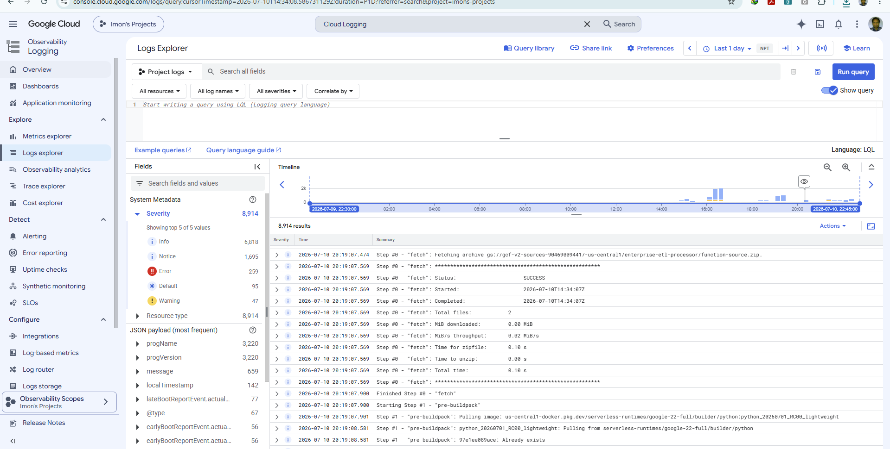

---

## Repository Structure

```
.
├── src/
│   ├── main.py              # Cloud Function core processing logic (CloudEvents handler)
│   └── requirements.txt     # Locked Python dependencies
├── scripts/
│   ├── deploy.py            # Infrastructure deployment orchestration & IAM setup
│   ├── test.py              # Automated E2E verification workflow
│   └── cleanup.py           # Resource teardown and cost prevention
├── screenshots/             # Production deployment visual evidence
├── .gitignore               # Strict exclusion of sensitive files
├── LICENSE                  # MIT License
└── README.md                # Enterprise Architecture documentation
```

---

## Skills Demonstrated
- **Google Cloud Platform (GCP)**: Mastered orchestration of serverless and data components.
- **Event-Driven Architecture**: Implementation of loosely coupled, highly scalable microservices.
- **Python Development**: Writing robust, PEP-8 compliant cloud execution code.
- **Identity & Access Management (IAM)**: Implementing the principle of least privilege.
- **Infrastructure Automation**: Building repeatable deployment workflows without reliance on point-and-click console usage.

### Future Improvements
While this project represents a production-ready baseline, future iterations could introduce:
1. **Terraform**: Transitioning the Python deployment script into declarative HashiCorp Terraform HCL.
2. **CI/CD Pipelines**: Incorporating GitHub Actions or Cloud Build to deploy code on Git push.
3. **Dead Letter Queues (DLQ)**: Implementing Pub/Sub DLQs for failed event processing retries.

### Cleanup Strategy
To avoid unnecessary cloud billing after the portfolio demonstration, a deterministic teardown script deletes all created resources (Buckets, Secrets, Functions, Eventarc Triggers, and Artifact Registry images):
```bash
python scripts/cleanup.py
```
